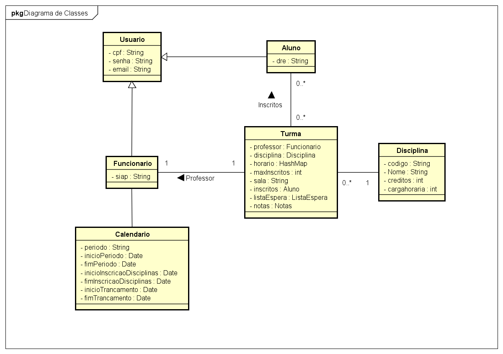

# Documento de Diagrama de Classes

> O objetivo deste documento é realizar a definição do diagrama de classes baseado nos casos de uso já feitos. Com essa modelagem e os documentos anteriores já construídos podemos iniciar a codificação do projeto, respeitando esse modelo e as limitações da tecnologia adotada.

## Equipe:

* Brian Confessor
* Heitor Guimarães
* Igor Amaral
* Marcelo Maestrelli

## Diagrama de Classes

