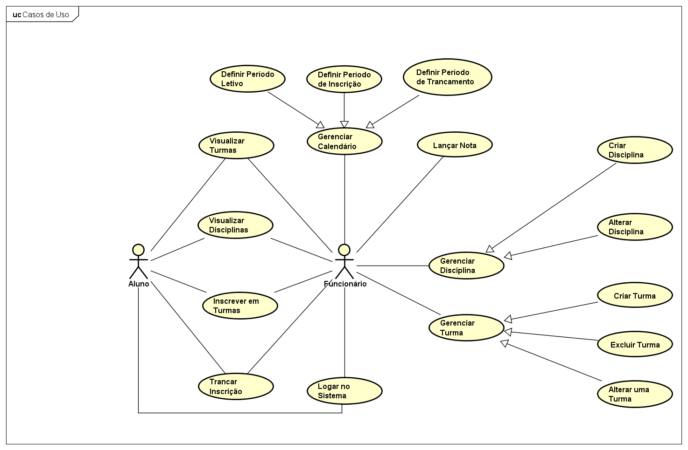

# Documento de Casos de Uso

> Documento com a especificação dos casos de uso descritos pela equipe, assim como o diagrama e as interfaces envolvidas nas descrições.

## Estrutura do Documento

O documento está dividido em duas partes principais: A primeira contém o diagrama dos casos de uso e um glossário de termos, mostrando as principais ideias de fluxos do projeto. A segunda parte contém as descrições detalhadas de cada diagrama de casos de uso.

## Diagrama de Casos de Uso

## Casos de Uso

### UC001

1. **Nome do caso de Uso**
	
	Logar no Sistema

2. **Objetivo**
	
	Permitir que o ator acesse o sistema

3. **Atores**
	
	Funcionário e Aluno

4. **Fluxo Principal**

	1. É apresentada uma interface [**[IUC001]**](#iuc001) para o ator inserir seus dados.
	2. O ator insere seu CPF
	3. O ator insere sua senha
	4. O ator realiza a ação de “Entrar” **[A1]**
	5. O sistema redireciona o ator para a interface principal [**[IUC002]**](#iuc002)

5. **Fluxo Alternativo**

	1. **[A1] Dados inválidos**

		Sistema informa que CPF ou Senha estão incorretos.
		O ator continua na mesma interface e tem a opção de refazer outras tentativas de Login.

---

### UC002

1. **Nome do caso de Uso**

	Gerenciar Disciplina

2. **Objetivo**

	Permitir que o ator realize uma série de operações sobre uma disciplina.

3. **Atores**

	Funcionário

4. **Pré-condição**
	
	Estar logado no sistema

5. **Trigger**
	
	Escolher a opção gerenciar disciplinas na interface principal do sistema [**[IUC002]**](#iuc002)

6. **Fluxo Principal**
	1. O ator seleciona a opção de gerenciamento de disciplinas
	2. O sistema fornece algumas opções de gerenciamento para o ator escolher de acordo com suas necessidades, sendo as opções:
		1. Criar Disciplina [**[Extend UC003]**](#uc003)
		2. Alterar Disciplina [**[Extend UC004]**](#uc004)
	3. O ator é redirecionado para a interface de acordo com a opção selecionada.

---

### UC003

1. **Nome do caso de Uso**

	Criar Disciplina

2. **Objetivo**

	Criar nova disciplina

3. **Atores**

	Funcionário

4. **Pré-condição**

	Estar logado no sistema

5. **Trigger**

	Ator escolher a opção de criação de novas disciplinas [**[IUC003]**](#iuc003)

6. **Fluxo Principal**

	1. O ator seleciona a opção de criação de Disciplinas e uma interface [**[IUC004]**](#iuc004) será aberta para inserir os dados.
		1. O ator fornece o código da nova disciplina **[R1]**
		2. O ator fornece o nome da disciplina
		3. O ator fornece o número de horas da disciplina **[R2]**
		4. O ator fornece o número de créditos da disciplina **[R3]**
	2. O ator envia suas informações para validação
	3. O sistema verifica a validade dos dados **[A1]**
	4. O sistema retorna uma mensagem de sucesso. **[A2]**

7. **Fluxo Alternativo**

	1. **[A1] Dados inválidos**

		Sistema informa quais campos estão inválidos

	2. **[A2] Mensagem para o ator**

		Sistema retorna uma mensagem de erro caso **[A1]** ocorra.

8. **Regras**

	1. **[R1]**: O código da disciplina deve conter 6 caracteres. Sendo os 3 primeiros formados por Letras e os 3 últimos por números.
	2. **[R2]**: A quantidade de horas de uma disciplina não deve exceder 6 horas semanais.
	3. **[R3]**: A quantidade de créditos de uma disciplina não pode ser superior a 6 e menor do que 1.

---

### UC004

1. **Nome do caso de Uso**

	Alterar Disciplina

2. **Objetivo**

	Alterar os dados de uma disciplina já existente

3. **Atores**

	Funcionário

4. **Pré-condição**

	1. Estar logado no sistema
	2. Disciplina não pode haver turmas abertas

5. **Trigger**

	Ator selecionar a opção de alterar disciplina [**[IUC003]**](#iuc003)

6. **Fluxo Principal**

	1. O ator seleciona a opção de alteração de Disciplinas e um modal [**[IUC004]**](#iuc004) será aberto com os dados atuais já preenchidos.
		1. O ator fornece o novo código da nova disciplina **[R1]**
		2. O ator fornece o novo nome da disciplina
		3. O ator fornece o novo número de horas da disciplina **[R2]**
		4. O ator fornece o novo número de créditos da disciplina **[R3]**
	2. O ator envia suas informações para validação
	3. O sistema verifica a validade dos dados **[A1]**
	4. O sistema retorna uma mensagem de sucesso. **[A2]**

7. **Fluxo Alternativo**

	1. **[A1] Dados inválidos**

		Sistema informa quais campos estão inválidos

	2. **[A2] Mensagem para o ator**

		Sistema retorna uma mensagem de erro caso [A1] ocorra.

8. **Regras**
	1. **[R1]**: O código da disciplina deve conter 6 caracteres. Sendo os 3 primeiros formados por Letras e os 3 últimos por números.
	2. **[R2]**: A quantidade de horas de uma disciplina não deve exceder 6 horas semanais.
	3. **[R3]**: A quantidade de créditos de uma disciplina não pode ser superior a 6 e menor do que 1.

---

### UC005

1. **Nome do caso de Uso**

	Gerenciar Turmas

2. **Objetivo**

	Permitir ao ator que gerencie as turmas de uma dada disciplina do programa de pós-graduação.

3. **Atores**

	Funcionário

4. **Pré-condição**

	Estar logado no sistema

5. **Trigger**

	Escolher a opção de gerenciar turmas na interface principal do sistema [**[IUC002]**](#iuc002)

6. **Fluxo Principal**

	1. O ator seleciona a aba de gerenciamento de turmas
	2. O sistema fornece algumas opções de gerenciamento para o ator escolher de acordo com suas necessidades, sendo as opções:
		1. Criar Turma [**[Extend UC006]**](#uc006)
		2. Alterar Turma [**[Extend UC007]**](#uc007)
		3. Excluir Turma [**[Extend UC008]**](#uc008)
	3. O ator é redirecionado para a interface de acordo com a opção selecionada.

---

### UC006

1. **Nome do caso de Uso**

	Criar Turma

2. **Objetivo**

	Criar nova turma de uma disciplina para um dado semestre letivo

3. **Atores**

	Funcionário

4. **Pré-condição**

	1. Estar logado no sistema.
	2. O professor da turma não pode ter nenhuma outra turma que sobreponha horário com esta nova.
	3. Não haver nenhuma outra turma no mesmo horário na sala em que esta nova turma está sendo cadastrada.

5. **Trigger**

	Ator selecionar a opção de criação de turmas [**[IUC005]**](#iuc005)

6. **Fluxo Principal**

	1. O ator seleciona a opção de criação de turmas em uma interface será aberta [**[IUC006]**](#iuc006) para o preenchimento das seguintes informações:
		1. O ator insere o código da disciplina
		2. O ator insere o SIAP do professor **[R1]**
		3. O ator insere o dia e horário da turma **[R2]**
		4. O ator insere o número máximo de inscritos
		5. O ator informa o número da sala da aula
	2. O ator envia suas informações para validação
	3. O sistema verifica a validade dos dados inseridos **[A1]**
	4. O sistema retorna uma mensagem de sucesso no cadastramento da turma **[A2]**

7. **Fluxo Alternativo**

	1. **[A1] Dados inválidos**

		Sistema informa quais campos estão inválidos

	2. **[A2] Mensagem para o ator**

		Sistema retorna uma mensagem de erro caso **[A1]** ocorra.

8. **Regras**

	1. **[R1]**: O SIAP é um registro numérico associado ao professor, individual e único.
	2. **[R2]**: Cada espaço de aula mínimo é de 2h. A quantidade de horas cadastradas deve bater com a Carga horária da disciplina.

---

### UC007

1. **Nome do caso de Uso**

	Alterar Turma

2. **Objetivo**

	Alterar os dados de uma turma já existente

3. **Atores**

	Funcionário

4. **Pré-condição**

	1. Estar logado no sistema
	2. Aulas da turma desejada não podem ter sido iniciadas
	3. O professor da turma não pode ter nenhuma outra turma que sobreponha horário com esta nova
	4. Não haver nenhuma outra turma no mesmo horário na sala em que esta turma está sendo realocada

5. **Trigger**

	Ator selecionar a opção de alterar turmas [**[IUC005]**](#iuc005)

6. **Fluxo Principal**

	1. O ator clica no botão de criação de turmas e uma interface será aberta [**[IUC006]**](IUC006), com os campos já preenchidos com os valores atuais, para o preenchimento das seguintes informações :
		1. O ator insere novo código da disciplina
		2. O ator insere novo SIAP do professor **[R1]**
		3. O ator insere novo dia e horário da turma **[R2]**
		4. O ator insere novo número máximo de inscritos
		5. O ator informa novo número da sala da aula
	2. O ator envia suas informações para validação
	3. O sistema verifica a validade dos dados inseridos **[A1]**
	4. O sistema retorna uma mensagem de sucesso na alteração da turma **[A2]**

7. **Fluxo Alternativo**
	1. **[A1] Dados inválidos**
		Sistema informa quais campos estão inválidos
	2. **[A2] Mensagem para o ator**
		Sistema retorna uma mensagem de erro caso **[A1]** ocorra.
8. **Regras**
	1. **[R1]**: O SIAP é um registro numérico associado ao professor, individual e único.
	2. **[R2]**: Cada espaço de aula mínimo é de 2h. A quantidade de horas cadastradas deve bater com a Carga horária da disciplina.

---

### UC008

1. **Nome do caso de Uso**

	Excluir Turma

2. **Objetivo**

	Excluir uma turma

3. **Atores**

	Funcionário

4. **Pré-condição**

	1. Estar logado no sistema
	2. Aulas da turma desejada não podem ter sido iniciadas

5. **Trigger**

	O ator deve selecionar a opção de excluir turma para iniciar o caso de uso [**[IUC005]**](#iuc005)

4. **Fluxo Principal**

	1. O ator seleciona a opção de excluir a turma
	2. O sistema pede confirmação para que ele decisão seja executada
	3. O sistema retorna uma resposta dizendo que a turma foi excluída **[A1][R1]**
	4. O sistema envia um e-mail para os alunos inscritos nesta turma para notificar sobre a exclusão

5. **Fluxo Alternativo**

	1. **[A1] Turma com aulas iniciadas**

		Caso as aulas de uma determinada turma já tenham começado, o sistema irá retorno uma mensagem de erro para a exclusão.

7. **Regras**

	1. **[R1]**: Aulas não podem ter começado para que ocorra a exclusão com sucesso

---

### UC009

1. **Nome do caso de Uso**

	Inscrever em Turmas

2. **Objetivo**

	Inscrever um Aluno em disciplinas

3. **Atores**

	Aluno e Funcionário

4. **Pré-condição**

	1. Estar logado no sistema
	2. Período de inscrição estar aberto (Para Aluno)
	3. Turma a ser inscrito deve ser do período atual

5. **Trigger**

	Selecionar a opção de “Inscrição em Disciplinas” [**[IUC002]**](#iuc002)

4. **Fluxo Principal**

	Ator Aluno se inscrevendo em disciplinas

	1. O sistema fornece uma lista de turmas disponíveis para aquele semestre, com a quantidade de créditos, horário e quantidade de inscritos atualmente. [**[IUC007]**](#iuc007)**[A1]**
	2. O ator seleciona um conjunto de turmas dentre a lista exibida.
	3. O ator seleciona a opção de “Confirmar Inscrição” [**[IUC007]**](#iuc007)
	4. O sistema retorna uma mensagem de sucesso para a inscrição. **[E1][E2][E3][R1]**
	5. O sistema envia um e-mail com a confirmação de inscrição em disciplinas

5. **Fluxo Alternativo**

	Ator Funcionário inscrevendo alunos em disciplinas

	1. O sistema fornece uma lista de turmas disponíveis para aquele semestre, com a quantidade de créditos, horário e quantidade de inscritos atualmente. Um campo para inserir o DRE do aluno em questão também é apresentado. [**[IUC008]**](#iuc008)
	2. O ator seleciona um conjunto de turmas dentre a lista exibida
	3. O ator seleciona a opção “Confirmar Inscrição” [**[IUC008]**](#iuc008)
	4. O sistema retorna uma mensagem de sucesso para a inscrição. **[E1][E2][E3][E4][R1]**

6. **Fluxo Exceção**

	1. **[E1]** Sobreposição de horário:
		O sistema deve retornar um erro caso haja sobreposição de horário nas matérias
	2. **[E2]** Lotação Esgotada:
		O sistema deve retornar um aviso informando ao ator que uma das disciplinas se encontra em situação de lotação esgotada e qual a posição da pessoa em questão na fila.
	3. **[E3]** Disciplina já cursada:
		O sistema deve retornar uma mensagem de erro caso o ator esteja tentando se inscrever em uma turma cuja disciplina já foi cursada anteriormente.
	4. **[E4]** DRE inválido:
		O sistema deve retornar uma mensagem de erro caso o ator funcionário tenha inserido um DRE inválido de aluno para a inscrição em disciplinas

7. **Regras**

	**[R1] Lotação Esgotada.**

		1. O aluno que se inscrever em uma turma na qual há mais inscritos do que vagas, ficará em uma lista de espera (Colocação por ordem de chegada).
		2. Sua situação poderá ser ajustada de acordo com a abertura de mais vagas por parte de um funcionário ou por desistência de outros Alunos.

---

### UC010

1. **Nome do caso de Uso**

	Lançar Notas

2. **Objetivo**

	Registrar notas dos Alunos

3. **Atores**

	Funcionário

4. **Pré-condição**

	1.Estar logado no sistema
	2. Aulas de uma turma devem estar encerradas

5. **Trigger**

	Ator selecionar a opção de “Lançamento de notas” [**[IUC002]**](#iuc002)

5. **Fluxo Principal**

	1. O ator seleciona a turma para a qual quer lançar notas
	2. O sistema fornece uma lista com o nome e DRE de todos os alunos inscritos naquela turma e um campo para escolher o conceito do aluno [**[IUC009]**](#iuc009)**[R1]**
	3. O ator envia as notas para a validação do sistema
	4. O sistema retorna uma mensagem de sucesso

6. **Fluxo Exceção**

	1. O ator também pode alterar a nota de um aluno, o procedimento é o mesmo do fluxo principal com a diferença que o Dropdown já virá com a atual nota preenchida

7. **Regras**

	1. **[R1]** Os conceitos disponíveis são: A,B,C e D

---

### UC011

1. **Nome do caso de Uso**

	Visualizar Disciplinas

2. **Objetivo**

	Listar disciplinas disponíveis

3. **Atores**

	Aluno e Funcionário

4. **Pré-condição**

	Estar logado no sistema

5. **Trigger**

	Ator seleciona a opção "Grade" no sistema [**[IUC002]**](#iuc002)

6. **Fluxo Principal**

	1. O sistema fornece uma lista de disciplinas cadastradas exibidas por ordem de cadastro

---

### UC012

1. **Nome do caso de Uso**

	Visualizar Turmas

2. **Objetivo**

	Listar disciplinas disponíveis para inscrição

3. **Atores**

	Aluno e Funcionário

4. **Pré-condição**

	1. Estar logado no sistema
	2. Deve estar dentro do período de inscrição em disciplinas

4. **Trigger**

	Ator seleciona a opção “Inscrição em Disciplinas” [**[IUC002]**](#iuc002)

5. **Fluxo Principal**

	O sistema exibe uma interface para a inscrição em turmas e todas as turmas abertas naquele semestre serão listadas para o ator.

---

### UC013

1. **Nome do caso de Uso**

	Trancar Inscrição

2. **Objetivo**

	Trancar a inscrição em uma disciplina de um Aluno

3. **Atores**

	Aluno e Funcionário

4. **Pré-condição**

	1. Estar logado no sistema
	2. Período em que inscrição foi realizada ainda deve estar ativo

4. **Fluxo Principal**

	1. O ator seleciona a opção “Inscrição em disciplinas” [**[IUC002]**](#iuc002)
	2. A lista de disciplinas que o ator já se inscreveu será fornecida para o aluno, junto com a opção de trancar **[A1]**[**[IUC007]**](#iuc007)
	3. Ao selecionar, o sistema retorna uma mensagem de sucesso no trancamento de tal disciplina para o ator.

5. **Fluxo Alternativo**

	1. O procedimento para o funcionário é similar, entretanto ele precisa informar o DRE do aluno no início [**[IUC008]**](#iuc008)

---

### UC014

1. **Nome do caso de Uso**

	Gerenciar Calendário

2. **Objetivo**

	Definir os períodos de inscrição, trancamento de disciplinas e duração do período letivo

3. **Atores**

	Funcionário

4. **Pré-condição**

	1. Estar logado no sistema

5. **Trigger**

	Ator selecionar a opção “Gerenciar Calendário” na interface principal do sistema

6. **Fluxo Principal**

	1. Ator seleciona o período que deseja editar **[R1]**
	2. Ator fornece a data de início e fim do período letivo
	3. Ator fornece a data de início e fim do período de inscrição em disciplinas
	4. Ator fornece a data de início e fim do período de trancamento de disciplinas
	5. Ator envia as informações para validação do sistema
	6. Sistema envia uma mensagem de sucesso para o ator **[E1]**

7. **Fluxo Exceção**

	1. **[E1] Datas inválidas**

		O sistema irá retornar uma mensagem de erro caso as datas escolhidas para o período não sejam consistentes

8. **Regras**

	1. **[R1]** Só é possível editar o calendário do período atual ou de períodos futuros

---

## Interfaces dos casos de Uso

### IUC001

**Descrição:** Tela inicial de Login para todos os usuários (Aluno ou funcionário)

### IUC002

**Descrição**: Homepage do ator “funcionário”

### IUC003

**Descrição**: Interface de gerenciamento de disciplinas

### IUC004

**Descrição**:  Modal para cadastramento ou alteração de disciplinas

### IUC005

**Descrição**: Tela de gerenciamento de Turmas

### IUC006

**Descrição**: Modal de criação e alteração de disciplinas

### IUC007

**Descrição**: Tela de inscrição de disciplinas para o ator Aluno

### IUC008

**Descrição**: Tela de inscrição de disciplinas para o ator Funcionário

### IUC009

**Descrição**: Tela para lançamento de notas para o ator Funcionário

